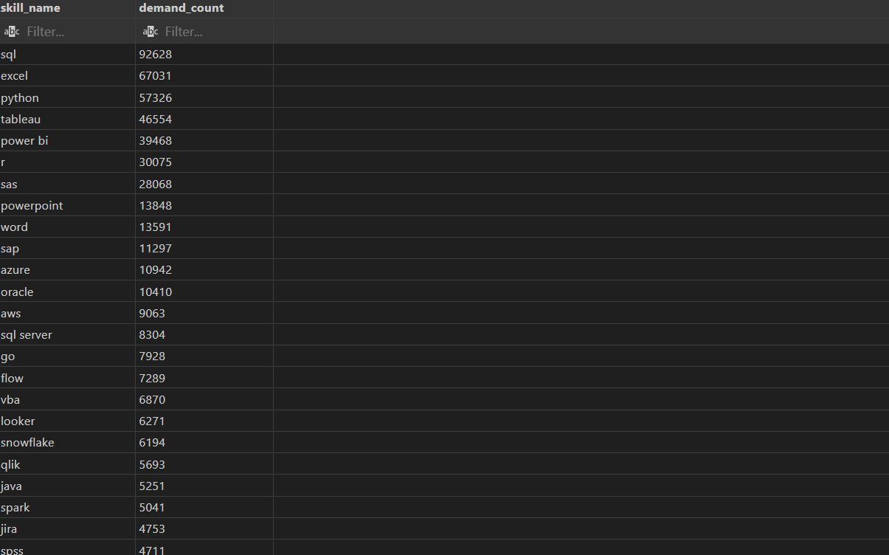

# Introduction
This project examines the 2024 data job market, with a focus on Data Analyst positions. It highlights key insights into the highest-paying roles, the most sought-after skills, and the best skills to prioritize for career growth.

Shortcut to all the SQL queries used:
[project_sql folder](/project_sql/)

# Background
As an aspiring data analyst, I wanted to dive deeper into SQL and add a Capstone project to my portfolio. 

### The questions I wanted to answer through my SQL queries were:

1. What are the top-paying data analyst jobs?
2. What skills are required for these top-paying jobs?
3. What skills are most in demand for data analysts?
4. Which skills are associated with higher salaries?
5. What are the most optimal skills to learn?
6. What are the top-paying data analyst jobs in Tampa, FL?

# Tools I Used
- **SQL:** Used to query the database and uncover insights.
- **PostgreSQL:** Database management system used to handle the job posting data.
- **Visual Studio Code:** Code editor of choice for executing SQL queries and database management.
- **Git & GitHub:** Used for version control and sharing my project.

# The Analysis
For this project, each query was designed to explore specific aspects of the Data Analyst job market. Here's the approach I took for each question:

### 1. Top Paying Data Analyst Jobs (Remote)
To identify the highest-paying roles, I filtered data analyst positions by average yearly salary and location, focusing on remote jobs. This query highlights the high paying opportunities in the data field.

```sql
select 
        job_id,
        job_title,
        job_location, 
        job_schedule_type,
        salary_year_avg,
        job_posted_date::DATE,
        name as comapany_name
from 
        job_postings_fact
LEFT JOIN company_dim ON 
          job_postings_fact.company_id=  company_dim.company_id 
WHERE
        job_title_short ='Data Analyst' and 
        job_work_from_home = 'True' AND 
        salary_year_avg is not NULL
ORDER BY salary_year_avg DESC
LIMIT 15;
```
The top 10 data analyst jobs in 2023 showcase a diverse range of roles with competitive salaries, starting with Mantys offering a Data Analyst position with an extraordinary salary of $650,000, likely reflecting a highly specialized or senior-level role. Meta follows with a Director of Analytics at $336,500, indicating a leadership position in a top tech company. AT&T offers an Associate Director- Data Insights role for $255,829.50, emphasizing data strategy and insights. 

Pinterest is hiring a Marketing Data Analyst for $232,423, blending analytics with marketing functions, while Uclahealthcareers has a Hybrid/Remote Data Analyst role at $217,000, offering flexibility. SmartAsset provides multiple positions, including a Principal Data Analyst (Remote) at $205,000, and another at $186,000, indicating high demand for senior analysts. 

Other notable roles include Director, Data Analyst (Hybrid) at Inclusively for $189,309, Principal Data Analyst, AV Performance Analysis at Motional for $189,000, and an ERM Data Analyst at Get It Recruit for $184,000. These jobs span industries and reflect the growing importance of data in decision-making and performance analysis.


*Bar graph visualizing the highest paying jobs for data analysts. ChatGPT generated this graph from my SQL query results.*

### 2. Skills for Top-Paying Data Analyst Jobs
Building on what I learned in the previous query, I joined the job postings data with the skills data to discover what skills are required for these top-paying jobs. *Important note - The two highest paying jobs from the previous query results are **not** in these results because the associated skills were not provided in the data (i.e. NULL values)*

```sql
with top_paying_jobs as(
     select 
            job_id,
            job_title,
            salary_year_avg,
            name as comapany_name
    from 
            job_postings_fact
    LEFT JOIN company_dim ON 
            job_postings_fact.company_id=  company_dim.company_id 
    WHERE
            job_title_short ='Data Analyst' and 
            job_work_from_home = 'True' AND 
            salary_year_avg is not NULL
    ORDER BY salary_year_avg DESC
    LIMIT 15
)

select top_paying_jobs.*,
        skills
from top_paying_jobs
inner join skills_job_dim on skills_job_dim.job_id=top_paying_jobs.job_id
inner join skills_dim on skills_dim.skill_id=skills_job_dim.skill_id
order by
         salary_year_avg DESC

```

*Bar graph visualizing the skill count for the top ten paying data analyst roles*

### 3. In Demand Skills for Data Analysts
This query identifies the top most frequently requested skills in job postings.

```sql
select skills AS SKILL_NAME,
        count(skills_job_dim.job_id) AS DEMAND_COUNT
from 
    job_postings_fact
inner join skills_job_dim on skills_job_dim.job_id=job_postings_fact.job_id
inner join skills_dim on skills_dim.skill_id=skills_job_dim.skill_id
where
     job_title_short ='Data Analyst'
GROUP BY
     skills
order by 
    DEMAND_COUNT DESC
Limit 5


```

| Power BI   | 2,609        |

### 4. Top Skills Based on Salary
This query calculates the average salary for each skill to identify which skills offer the highest pay.

```sql
select skills AS SKILL_NAME,
        round(avg(salary_year_avg),0) as pay_scale_per_skill
from 
    job_postings_fact
inner join skills_job_dim on skills_job_dim.job_id=job_postings_fact.job_id
inner join skills_dim on skills_dim.skill_id=skills_job_dim.skill_id
where
     job_title_short ='Data Analyst' and salary_year_avg is not NULL
GROUP BY
     skills
order by 
    pay_scale_per_skill DESC

```
Here's a breakdown of the top-paying skills for data analysts:

1. PySpark: $208,172
   - Use: Big data processing and analytics.

2. DataRobot: $155,486
   - Use: Automated machine learning platform.

3. Jupyter: $152,777
   - Use: Interactive notebooks for live code and data analysis.

4. Pandas: $151,821
   - Use: Data manipulation and analysis in Python.

5. Databricks: $141,907
   - Use: Unified analytics platform for big data and AI.

6. Scikit-learn: $125,781
   - Use: Machine learning library in Python for predictive data analysis.

7. PostgreSQL: $123,879
   - Use: Advanced relational database management system.

*Note: While skills like Bitbucket, Couchbase, and Watson are high-paying, they are less directly related to typical data analyst functions compared to the skills listed above.*


*Table of the top 10 skills based on the average salary*

### 5. Most Optimal Skills for Data Analysts
By analyzing both demand and salary data, this query identifies skills that are highly sought after and offer high salaries, providing a strategic focus for skill development.

```sql
WITH skill_demand AS (
    SELECT  
        skills_dim.skills AS SKILL_NAME,
        skills_job_dim.skill_id,
        COUNT(skills_job_dim.job_id) AS DEMAND_COUNT
    FROM 
        job_postings_fact
    INNER JOIN skills_job_dim ON skills_job_dim.job_id = job_postings_fact.job_id
    INNER JOIN skills_dim ON skills_dim.skill_id = skills_job_dim.skill_id
    WHERE
        job_title_short = 'Data Analyst' 
        AND salary_year_avg IS NOT NULL 
    GROUP BY
        skills_dim.skills, skills_job_dim.skill_id
),
average_salary AS (
    SELECT
        skills_job_dim.skill_id,
        ROUND(AVG(salary_year_avg), 0) AS pay_scale_per_skill
    FROM 
        job_postings_fact
    INNER JOIN skills_job_dim ON skills_job_dim.job_id = job_postings_fact.job_id
    INNER JOIN skills_dim ON skills_dim.skill_id = skills_job_dim.skill_id
    WHERE
        job_title_short = 'Data Analyst' 
        AND salary_year_avg IS NOT NULL
    GROUP BY
        skills_job_dim.skill_id
)
SELECT 
    skill_demand.skill_id,
    skill_demand.skill_name,
    skill_demand.DEMAND_COUNT,
    average_salary.pay_scale_per_skill
FROM skill_demand
INNER JOIN average_salary 
    ON skill_demand.skill_id = average_salary.skill_id
where DEMAND_COUNT > 10
order by 
    --DEMAND_COUNT desc , 
    pay_scale_per_skill DESC,
    DEMAND_COUNT desc 
limit 25;

```


*Table of the most optimal skills for Data Analysts, sorted by salary* 

The most optimal skills for data analysts include Go, Confluence, Hadoop, Snowflake, Azure, BigQuery, AWS, Java, SSIS, and Jira. These skills have strong demand, with Go leading in both demand and average salary at $115,320. Specialized tools like Snowflake and BigQuery also command high salaries, highlighting the value of cloud and data management expertise in the job market. Proficiency in programming languages like Java and expertise in AWS and Azure are similarly rewarding for data professionals.


# Insights
1. **Top-Paying Data Analyst Jobs:** The highest-paying jobs for data analysts that allow remote work, the highest at $650,000!
2. **Skills for Top-Paying Jobs:** High-paying data analyst positions demand advanced proficiency in SQL, indicating that this skill is essential for securing a top salary.
3. **Most In Demand Skills:** SQL is the most sought-after skill in the data analyst job market, making it crucial for job seekers.
4. **Skills with Higher Salaries:** Specialized skills like PySpark and Bitbucket are linked to the highest average salaries for data analysts, highlighting the value placed on niche expertise.
5. **Optimal Skills for Job Market Value:** Go ranks highest in both demand and average salary, making it a highly valuable skill for a Data Analyst to learn. However, SQL remains the most in-demand skill overall and still offers a competitive average salary.
6. **Top-Paying Data Analyst Jobs in Tampa, FL:** The top 10 highest paying jobs in Tampa, FL had a salary range of $132K to $189K!

# What I Learned
While I already knew the basics of SQL thanks to the Google Data Analytics Professional Certificate, this course improved my skills immensely. I learned..

- How to use PostgreSQL with Visual Studio Code to create and query my own local databases.
- How to upload a local repository to a remote repository on GitHub using VSC.
- More about subqueries and Common Table Expressions (CTEs) to help organize and simplify complex queries.
